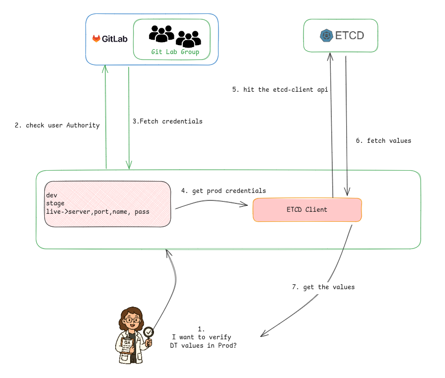

## Etcd CLI Reader

A simple, fast, and developer-friendly CLI tool to fetch etcd values directly from your terminal. Designed to improve developer productivity by eliminating the need for complex etcd operations or path memorization.




## Features
* Quickly fetch etcd values from dev, stage, or production environments
* Securely fetch credentials using a private GitLab group
* No need to remember or type full etcd key paths
* One-time setup with environment-specific configurations
* Clean and non-intrusive: Uses a lock file to detect first-time setup

> ###  Prerequisites
>  * Go (latest version) must be installed  
>  * GitLab personal access token with read access to the secret project(s)
---

## Installation
1. #### Clone the repo (or get it using go get if hosted)
```bash
   git clone https://devshehan/etcd-cli
   cd etcd-cli
```
2. #### Edit the `install.sh`  
Replace placeholders like `PERSONAL-ACCESS-TOKEN`, with your actual token.

3. #### Run installation script
```bash
   chmod +x install.sh
   ./install.sh
```
4. #### Reload your shell script
```bash
    source ~/.bashrc
```
5. #### Run the CLI
```bash
    etcdreader
```
or reset and reinit
```bash
    etcdreader --reset
```

---

## How It Works
1. On first run, the CLI checks for .initialized.lock to see if setup has already been done.
2. If not initialized:
   * Uses the appropriate GitLab group ID for that environment.
   * Fetches etcd access credentials via GitLab.
   * Updates properties.yaml file with the fetched credentials.
   * Marks initialization complete via .initialized.lock.
3. On subsequent runs, the CLI:
   * Skips re-auth and fetches etcd keys directly using saved config.
4. If the user wants to change the etcd access credentials manually, they are allowed to do so—but only after completing the initial one-time authorization

### Notes
The CLI alias is installed as etcdreader. You can run it from anywhere in the terminal.  
To reset the configuration and reinitialize:
```bash
    etcdreader --reset
```

### Author
Shehan – Backend Engineer at PickMe
Contact: shehaan.avishka00@gmail.com


